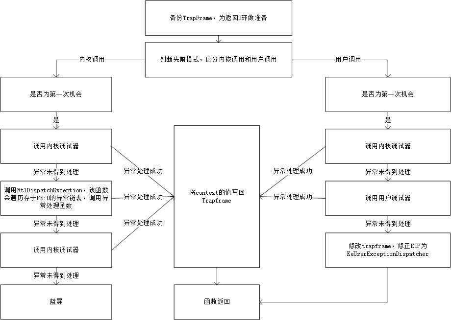

<!-- TOC -->

- [1. 异常与调试](#1-异常与调试)
- [2. 异常的流程](#2-异常的流程)
- [3. 异常的类别](#3-异常的类别)
    - [3.1. 按照产生源分类](#31-按照产生源分类)
    - [3.2. 按照产生位置分类](#32-按照产生位置分类)
- [4. 记录异常信息](#4-记录异常信息)
    - [4.1. 模拟异常的特殊填充](#41-模拟异常的特殊填充)
- [5. 异常分发：KiDispatchException](#5-异常分发kidispatchexception)
- [6. 异常处理](#6-异常处理)
    - [6.1. 异常处理结构体：_EXCEPTION_REGISTRATION_RECORD](#61-异常处理结构体_exception_registration_record)
    - [6.2. 用户异常在3环的处理](#62-用户异常在3环的处理)
        - [6.2.1. RtlDispatchException](#621-rtldispatchexception)
- [7. SEH的try{}拓展](#7-seh的try拓展)
    - [7.1. 异常过滤（except）](#71-异常过滤except)
    - [7.2. VC6拓展：VC_EXCEPTION_REGISTRATION](#72-vc6拓展vc_exception_registration)
        - [7.2.1. VC_EXCEPTION_REGISTRATION成员](#721-vc_exception_registration成员)
        - [7.2.2. __except_handler3](#722-__except_handler3)
    - [7.3. finally](#73-finally)
        - [7.3.1. 局部展开](#731-局部展开)
        - [7.3.2. 全局展开](#732-全局展开)
- [8. 异常处理函数](#8-异常处理函数)
    - [8.1. 返回值](#81-返回值)
- [9. 未处理异常](#9-未处理异常)
    - [9.1. 程序的最后一道异常防线](#91-程序的最后一道异常防线)
    - [9.2. 函数过滤：UnhandledExceptionFilter](#92-函数过滤unhandledexceptionfilter)
        - [9.2.1. 有调试器](#921-有调试器)
        - [9.2.2. 无调试器](#922-无调试器)
        - [9.2.3. 反调试](#923-反调试)

<!-- /TOC -->
# 1. 异常与调试
异常与调试是紧密相连的，异常是调试的基础。软件调试、反调试、调试器都与异常息息相关。
# 2. 异常的流程
异常产生后，首先要记录异常信息（异常类型、异常发生的位置等），然后进行异常分发（寻找异常的处理函数）和异常处理（调用异常处理函数）。
# 3. 异常的类别
## 3.1. 按照产生源分类
* CPU异常：由CPU产生、发现的异常
* 模拟异常：由软件模拟产生，如throw、raise语句
## 3.2. 按照产生位置分类
* 内核异常：在内核产生的异常
* 用户异常：在用户空间产生的异常
# 4. 记录异常信息

throw关键词和CxxThrowException为C语言的模拟异常特征，其它编程语言提供的模拟异常机制的这两点（关键词和初始调用函数）是不同的。
## 4.1. 模拟异常的特殊填充
模拟异常在填充ExceptionRecord结构体的时候，ExceptionCode为一个固定值，该值依赖于编译环境；ExceptionAddress也是固定值，为RaiseException函数的地址。
# 5. 异常分发：KiDispatchException
所有类型的异常均通过KiDispatchException函数分发。

* 用户模式第一次机会，会优先调用内核调试器，如果不存在内核调试器或者内核调试器未处理，才会调用DbgkForwardException（汇编代码分析得知）
* 内核RtlDispatchException会遍历存于fs:[0]的异常链表调用异常处理函数。
* KeBugCheckEx即为蓝屏
# 6. 异常处理
## 6.1. 异常处理结构体：_EXCEPTION_REGISTRATION_RECORD
0环异常处理和3环的SEH异常处理均使用该结构体，有的编译器会对这个结构体进行拓展。
## 6.2. 用户异常在3环的处理
KiUserExceptionDispatcher函数会调用ntdll!RtlDispatchException函数来寻找异常处理函数处理异常，如果处理成功则会调用ZwContinue（ZwContinue调用NtContinue，主要作用就是进入0环，恢复TrapFrame然后通过KiServiceExit再次返回到3环，回到修正后的位置继续执行），如果处理失败则会调用ZwRaiseException来对异常进行二次分发。
### 6.2.1. RtlDispatchException
该函数与内核模块中的函数同名，但是功能略有不同。这个函数会先遍历VEH链表（全局异常函数链表，线程无关）并调用异常处理函数；如果没有VEH函数或者异常未得到处理，则会遍历位于fs:[0]的SEH链表（位于堆栈，线程私有）并调用异常处理函数。
# 7. SEH的try{}拓展
编译器提供的try{}拓展可以很方便的挂入异常、异常过滤、异常处理和清理工作。
```c
__try{}        //挂入异常
__except(){}   //异常过滤及异常处理
//try只能和except和finally中的任意一个进行搭配
__try{}
__finally{}    //清理工作
```
## 7.1. 异常过滤（except）
括号内的值必须是以下三个值：
* EXCEPTION_EXECUTE_HANDLER（1）执行代码
* EXCEPTION_CONTINUE_SEARCH（0）寻找下一个异常处理函数
* EXCEPTION_CONTINUE_EXECUTION（-1）返回出错位置继续执行
## 7.2. VC6拓展：VC_EXCEPTION_REGISTRATION
VC6拓展了结构体_EXCEPTION_REGISTRATION_RECORD为VC_EXCEPTION_REGISTRATION，以实现在一个函数内，无论嵌套或者重复使用try{}多少次，都只注册一个异常处理函数（__except_handler3），挂入一个异常处理结构体（递归函数除外，每次递归都会注册新的异常处理函数，挂入新的异常处理结构体）。
### 7.2.1. VC_EXCEPTION_REGISTRATION成员
scopetable指向了一个scopetable_entry结构体数组，函数中每个try{}都会在其中占据一个位置。_index会在函数执行期间被改变（每当代码进入新的try{}结构时该值会变化），该值指示当前执行代码所位于的try{}结构在scopetable中的索引，如果当前执行代码不位于任何try{}结构中，_index会被设置为-1。
### 7.2.2. __except_handler3
发生异常之后，该函数会接管代码。然后根据_index选择scopetable中对应的scopetable_entry，并调用lpfnFilter、lpfnHandler函数。如果异常未得到处理，需要寻找下一个异常处理函数，则根据prev_entryindex向上查找并调用，直到prev_entryindex值为-1即无上层。
## 7.3. finally
即使在try代码块中发生异常、continue、break甚至return，finally代码块中的代码都会得到执行，除非直接exit退出程序。
### 7.3.1. 局部展开
当try代码块提前结束时（continue、break、return），会在结束之前调用local_unwind函数，该函数会调用finally代码块。
### 7.3.2. 全局展开
当try代码块发生异常时，会先寻找except代码，然后重新从异常发生位置开始遍历，并依次调用局部展开函数，最后再执行except代码。
# 8. 异常处理函数
异常处理函数必须遵守一定的格式，其参数必须为4个：异常信息、异常处理结构体、异常发生时的上下文、DispatcherContext。
## 8.1. 返回值
* 成功处理异常，返回EXCEPTION_CONTINUE_EXECUTION（-1）
* 未能成功处理异常，返回EXCEPTION_CONTINUE_SEARCH（0）
# 9. 未处理异常
## 9.1. 程序的最后一道异常防线
进程从kernel32.dll!BaseProcessStart开始执行，线程从kernel32.dll!BaseThreadStart开始执行，这两个函数都会在一开始添加一个SEH，来作为程序的最后一道异常防线。
## 9.2. 函数过滤：UnhandledExceptionFilter
该函数会通过NtQueryInformationProcess的DebugPort方式来查询当前进程是否正在被调试。
### 9.2.1. 有调试器
函数返回EXCEPTION_CONTINUE_SEARCH，进入第二轮分发。第二轮分发的流程同于模拟异常的分发流程，但是会被设置为第二次机会。
### 9.2.2. 无调试器
查询是否曾通过SetUnhandledExceptionFilter注册处理函数，有则调用，没有则会弹出窗口让用户选择终止程序还是启动即时调试器，如果没有启动即时调试器，该函数返回EXCEPTION_EXECUTE_HANDLER，执行except代码来终止线程或者进程。
### 9.2.3. 反调试
将功能代码放到SetUnhandledExceptionFilter注册的处理函数中，如果不存在调试器，会得到执行，如果存在调试器则不会被执行。该方法可被Hook函数NtQueryInformationProcess或者修改DebugPort破解。