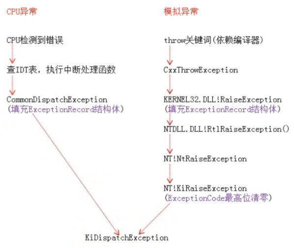

<!-- TOC -->

- [1. 异常与调试](#1-异常与调试)
- [2. 异常的流程](#2-异常的流程)
- [3. 异常的类别](#3-异常的类别)
    - [3.1. 按照产生源分类](#31-按照产生源分类)
    - [3.2. 按照产生位置分类](#32-按照产生位置分类)
- [4. 记录异常信息](#4-记录异常信息)
    - [4.1. 模拟异常的特殊填充](#41-模拟异常的特殊填充)
- [5. 异常分发：KiDispatchException](#5-异常分发kidispatchexception)
- [6. 异常处理](#6-异常处理)
    - [6.1. 异常处理结构体：_EXCEPTION_REGISTRATION_RECORD](#61-异常处理结构体_exception_registration_record)
    - [6.2. 用户异常在3环的处理](#62-用户异常在3环的处理)
    - [6.3. RtlDispatchException](#63-rtldispatchexception)
- [7. SEH的try{}拓展](#7-seh的try拓展)
    - [7.1. 异常过滤（except）](#71-异常过滤except)
    - [7.2. VC6拓展：VC_EXCEPTION_REGISTRATION](#72-vc6拓展vc_exception_registration)
        - [7.2.1. scopetable](#721-scopetable)
        - [7.2.2. _index](#722-_index)
        - [7.2.3. _ebp](#723-_ebp)
        - [7.2.4. __except_handler3](#724-__except_handler3)
- [8. 异常处理函数](#8-异常处理函数)
    - [8.1. 返回值](#81-返回值)

<!-- /TOC -->
# 1. 异常与调试
异常与调试是紧密相连的，异常是调试的基础。软件调试、反调试、调试器都与异常息息相关。
# 2. 异常的流程
异常产生后，首先要记录异常信息（异常类型、异常发生的位置等），然后进行异常分发（寻找异常的处理函数）和异常处理（调用异常处理函数）。
# 3. 异常的类别
## 3.1. 按照产生源分类
* CPU异常：由CPU产生、发现的异常
* 模拟异常：由软件模拟产生，如throw、raise语句
## 3.2. 按照产生位置分类
* 内核异常：在内核产生的异常
* 用户异常：在用户空间产生的异常
# 4. 记录异常信息

throw关键词和CxxThrowException为C语言的模拟异常特征，其它编程语言提供的模拟异常机制的这两点（关键词和初始调用函数）是不同的。
## 4.1. 模拟异常的特殊填充
模拟异常在填充ExceptionRecord结构体的时候，ExceptionCode为一个固定值，该值依赖于编译环境；ExceptionAddress也是固定值，为RaiseException函数的地址。
# 5. 异常分发：KiDispatchException
所有类型的异常均通过KiDispatchException函数分发。

函数返回之后，CPU异常在CommonDisPatchException中通过IRETD返回3环，模拟异常在KiRaiseException中通过系统调用返回3环并执行ntdll!KiUserExceptionDispatcher。
# 6. 异常处理
## 6.1. 异常处理结构体：_EXCEPTION_REGISTRATION_RECORD
0环异常处理和3环的SEH异常处理均使用该结构体，有的编译器会对这个结构体进行拓展。
## 6.2. 用户异常在3环的处理
KiUserExceptionDispatcher函数会调用RtlDispatchException函数来寻找异常处理函数处理异常，如果处理成功则会调用ZwContinue（ZwContinue调用NtContinue，主要作用就是进入0环，恢复TrapFrame然后通过KiServiceExit再次返回到3环），如果处理失败则会调用ZwRaiseException来对异常进行二次分发。
## 6.3. RtlDispatchException
该函数与ntoskrnl.exe内核模块中的函数同名，但是功能略有不同。这个函数在查找到异常链表之后，会检查当前异常处理结构体是否位于堆栈之中。之后会调用RtlpExecuteHandlerForException来真正执行异常处理函数。先查找VEH链表（XP及之后系统的机制，全局链表，线程无关），如果有则调用；如果没有或者异常未得到处理，则会查找当前线程的SEH链表（Windows系统特有机制，fs:[0]定位，位于堆栈，线程私有），如果有则调用。
# 7. SEH的try{}拓展
编译器提供的try{}拓展可以很方便的提供挂入异常、异常过滤、异常处理的机制。
## 7.1. 异常过滤（except）
该值可以是：
* 固定值
* 表达式
* 函数调用
但是他们最后的返回值必须是以下三个值：
* EXCEPTION_EXECUTE_HANDLER（1）执行代码
* EXCEPTION_CONTINUE_SEARCH（0）寻找下一个异常处理函数
* EXCEPTION_CONTINUE_EXECUTION（-1）返回出错位置继续执行
## 7.2. VC6拓展：VC_EXCEPTION_REGISTRATION
VC6拓展了结构体_EXCEPTION_REGISTRATION_RECORD为VC_EXCEPTION_REGISTRATION，以实现在一个函数内，无论嵌套或者重复使用try{}多少次，都只注册一个异常处理函数（__except_handler3），挂入一个异常处理结构体（递归函数除外，每次递归都会注册新的异常处理函数，挂入新的异常处理结构体）。
### 7.2.1. scopetable
scopetable指向了一个scopetable_entry结构体数组，函数中每对try{}都会在其中占据一个位置。scopetable_entry.prev_entryindex为该try{}结构的上层try{}结构在scopetable中的索引，如果没有上层try{}结构，则该值为-1。
### 7.2.2. _index
该值会在函数执行期间被改变（每当代码进入新的try{}结构时该值会变化），该值指示当前执行代码所位于的try{}结构在scopetable中的索引。如果当前执行代码不位于任何try{}结构中，该值会被设置为-1。
### 7.2.3. _ebp
函数起始时压入的ebp，上一个函数体的栈基址。
### 7.2.4. __except_handler3
发生异常之后，该函数会接管代码。然后根据_index选择scopetable中对应的scopetable_entry，并调用lpfnFilter、lpfnHandler函数。如果异常未得到处理，需要寻找下一个异常处理函数，则根据prev_entryindex向上查找并调用，直到prev_entryindex值为-1即无上层。
# 8. 异常处理函数
异常处理函数必须遵守一定的格式，其参数必须为4个：异常信息、异常处理结构体、异常发生时的上下文、DispatcherContext。
## 8.1. 返回值
* 成功处理异常，返回EXCEPTION_CONTINUE_EXECUTION（-1）
* 未能成功处理异常，返回EXCEPTION_CONTINUE_SEARCH（0）
