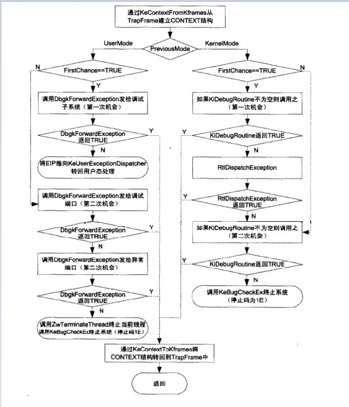

<!-- TOC -->

- [1. 异常与调试](#1-异常与调试)
- [2. 异常的流程](#2-异常的流程)
- [3. 异常的类别](#3-异常的类别)
    - [3.1. 按照产生源分类](#31-按照产生源分类)
    - [3.2. 按照产生位置分类](#32-按照产生位置分类)
- [4. 记录异常信息](#4-记录异常信息)
    - [4.1. 模拟异常的特殊填充](#41-模拟异常的特殊填充)
- [5. 异常分发](#5-异常分发)
    - [5.1. KiDispatchException函数](#51-kidispatchexception函数)
    - [5.2. ntdll!KiUserExceptionDispatcher](#52-ntdllkiuserexceptiondispatcher)
- [6. 向量化异常处理：VEH](#6-向量化异常处理veh)
- [7. SEH](#7-seh)
- [8. _EXCEPTION_REGISTRATION_RECORD](#8-_exception_registration_record)
- [9. SEH拓展](#9-seh拓展)
    - [9.1. 基础功能](#91-基础功能)
    - [9.2. VC6拓展：VC_EXCEPTION_REGISTRATION](#92-vc6拓展vc_exception_registration)
        - [9.2.1. scopetable](#921-scopetable)
        - [9.2.2. _index](#922-_index)
        - [9.2.3. _ebp](#923-_ebp)
        - [9.2.4. __except_handler3](#924-__except_handler3)
- [10. 异常处理函数](#10-异常处理函数)
- [11. RtlDispatchException](#11-rtldispatchexception)

<!-- /TOC -->
# 1. 异常与调试
异常与调试是紧密相连的，异常是调试的基础。软件调试、反调试、调试器都与异常息息相关。
# 2. 异常的流程
异常产生后，首先要记录异常信息（异常类型、异常发生的位置等），然后进行异常分发（寻找异常的处理函数）和异常处理（调用异常处理函数）。
# 3. 异常的类别
## 3.1. 按照产生源分类
* CPU异常：由CPU产生、发现的异常
* 模拟异常：由软件模拟产生，如throw、raise语句
## 3.2. 按照产生位置分类
* 内核异常：在内核产生的异常
* 用户异常：在用户空间产生的异常
# 4. 记录异常信息

throw关键词和CxxThrowException为C语言的模拟异常特征，其它编程语言提供的模拟异常机制这两点（关键词和初始调用函数）是不同的。
## 4.1. 模拟异常的特殊填充
模拟异常在填充ExceptionRecord结构体的时候，ExceptionCode为一个固定值，该值依赖于编译环境；ExceptionAddress也是固定值，为RaiseException函数的地址。
# 5. 异常分发
所有类型的异常均通过KiDispatchException函数分发，所以这个函数是异常分发的关键。
## 5.1. KiDispatchException函数

RtlDispatchException为库函数，三环、内核均可调用。对于用户调用，如果异常未得到0环、3环调试器的处理，则需要由3环的异常处理函数来处理。设置了TrapFrame的返回地址等信息后，在函数返回之后，CPU异常在CommonDisPatchException中通过IRETD返回3环，模拟异常在KiRaiseException中通过系统调用返回3环，返回3环后，将会执行ntdll!KiUserExceptionDispatcher。
## 5.2. ntdll!KiUserExceptionDispatcher
这个函数会调用RtlDispatchException来寻找异常处理函数处理异常，如果处理成功则会调用ZwContinue（ZwContinue调用NtContinue，主要作用就是进入0环，恢复TrapFrame然后通过KiServiceExit返回到3环），如果处理失败则会调用ZwRaiseException来对异常进行二次分发。这里的RtlDispatchException与ntoskrnl.exe内核模块中的函数同名，但是功能略有不同。这个函数会先查找VEH链表（全局链表，线程无关），如果有则调用；如果没有或者未处理，则会查找当前线程的SEH链表（线程私有，位于堆栈的局部链表，结构化异常处理链表），如果有则调用。
# 6. 向量化异常处理：VEH
XP及之后的系统引入的机制
# 7. SEH
SEH链表和0环的异常链表结构相同，且均通过fs:[0]查找。0环kpcr、3环teb，第一个成员均为NtLib，而NtLib的第一个成员均为ExceptionList。SEH为Windows特有机制。
# 8. _EXCEPTION_REGISTRATION_RECORD
这个结构体是可以拓展的，他最少拥有两个成员，是Windows的异常处理机制的最基础成员，有的编译器会对这个结构体进行拓展。
# 9. SEH拓展
## 9.1. 基础功能
为了简便操作，编译器提供了try、except拓展，该拓展很方便的提供了挂入异常、异常过滤、异常处理的机制，其中except（异常过滤）的括号里面的内容可以是：
* 值
* 表达式
* 函数调用
但是他们最后的返回值必须是以下三个值： 
* EXCEPTION_EXECUTE_HANDLER（1）执行代码
* EXCEPTION_CONTINUE_SEARCH（0）寻找下一个异常处理函数
* EXCEPTION_CONTINUE_EXECUTION（-1）返回出错位置继续执行
## 9.2. VC6拓展：VC_EXCEPTION_REGISTRATION
VC6拓展了结构体_EXCEPTION_REGISTRATION_RECORD为VC_EXCEPTION_REGISTRATION，以实现在一个函数内，无论嵌套或者重复使用try{}多少次，都只注册一个异常处理函数（__except_handler3），挂入一个异常处理结构体（递归函数除外，每次递归都会注册新的异常处理函数，挂入新的异常处理结构体）。
### 9.2.1. scopetable
scopetable指向了一个scopetable_entry结构体数组，函数中每对try{}都会在其中占据一个位置。scopetable_entry.prev_entryindex为该try{}结构的上层try{}结构在scopetable中的索引，如果没有上层try{}结构，则该值为-1。
### 9.2.2. _index
该值会在函数执行期间被改变（每当代码进入新的try{}结构时该值会变化），该值指示当前执行代码所位于的try{}结构在scopetable中的索引。如果当前执行代码不位于任何try{}结构中，该值会被设置为-1。
### 9.2.3. _ebp
函数起始时压入的ebp，上一个函数体的栈基址。
### 9.2.4. __except_handler3
发生异常之后，该函数会接管代码。然后根据_index选择scopetable中对应的scopetable_entry，并调用lpfnFilter、lpfnHandler函数。如果异常未得到处理，需要寻找下一个异常处理函数，则根据prev_entryindex向上查找并调用，直到prev_entryindex值为-1即无上层。
# 10. 异常处理函数
如果异常处理函数成功处理异常，则返回EXCEPTION_CONTINUE_EXECUTION（-1），如果未能成功处理异常，则返回EXCEPTION_CONTINUE_SEARCH（0）。异常处理函数必须遵守一定的格式，其参数必须为4个（异常信息、异常处理结构体、异常发生时的上下文、DispatcherContext）。
# 11. RtlDispatchException
这个函数在查找到异常链表之后，会检查当前异常处理结构体是否位于堆栈之中。之后会调用RtlpExecuteHandlerForException来真正执行异常处理函数